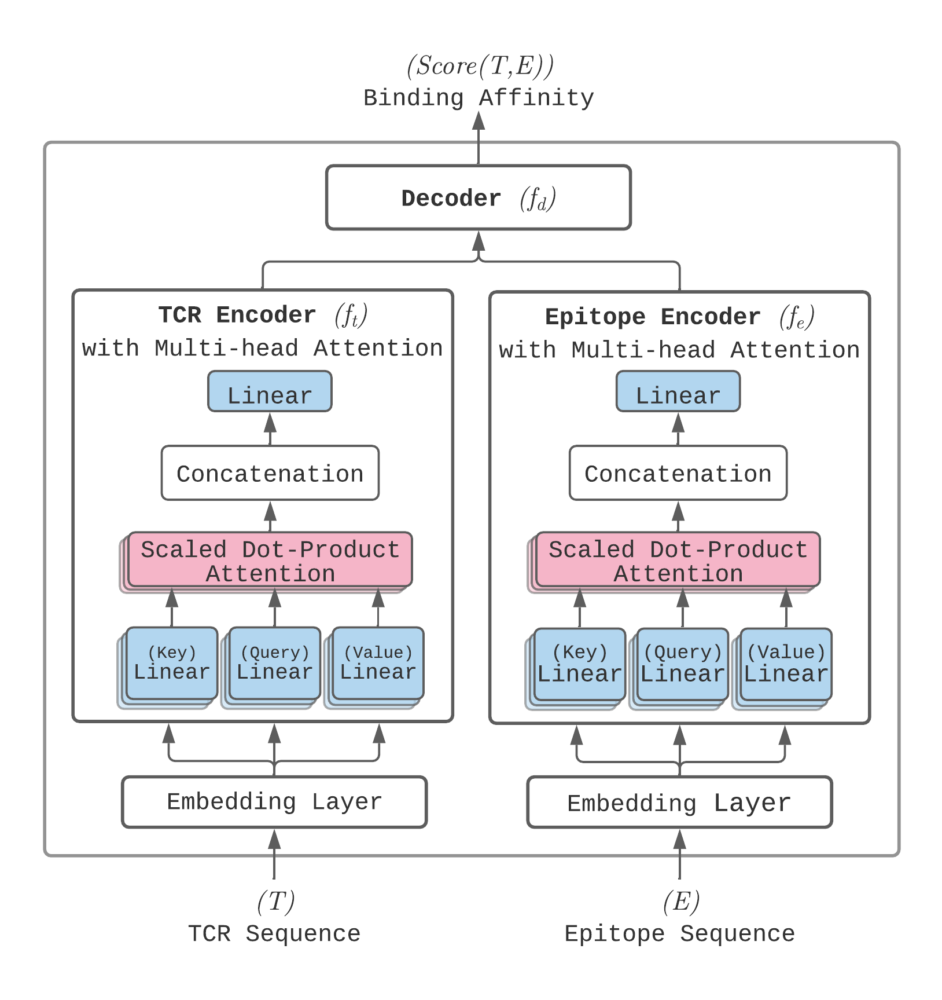

<h1 align="center">
    ATM-TCR
</h1>

ATM-TCR demonstrates how a multi-head self-attention based model can be utilized to learn structural information from protein sequences to make binding affinity predictions.

## Publication
<b>ATM-TCR: TCR-Epitope Binding Affinity Prediction Using a Multi-Head Self-Attention Model</b>  
[Michael Cai](https://github.com/cai-michael)1,2, [Seojin Bang](https://github.com/SeojinBang)2, [Pengfei Zhang](https://github.com/pzhang84)1,2, [Heewook Lee](https://scai.engineering.asu.edu/faculty/computer-science-and-engineering/heewook-lee/)1,2 
1 School of Computing and Augmented Intelligence, Arizona State University, 2 Biodesign Institute, Arizona State University  
Published in: [**Frontiers in Immunology, 2022.**](https://www.frontiersin.org/articles/10.3389/fimmu.2022.893247/full)

## Model Structure

The model takes a pair epitope and TCR sequences as input and returns the binding affinity between the two. The sequences are processed through an embedding layer before reaching the multi-head self-attention layer. The outputs of these layers are then concatenated and fed through a linear decoder layer to receive the final binding affinity score.

## Modified Model Architecture:

### Modifications Made:
1. **Incorporation of Additional Activation Functions:**
   - Added a ReLU activation function after one of the linear layers in the decoder to introduce non-linearity and enhance feature learning.
   - Used a Sigmoid activation function at the final output layer to produce a probability score for binary classification.

2. **Enhanced Data Normalization:**
   - Applied normalization to the concatenated embeddings of TCR and epitope sequences before passing them to the decoder.

3. **Custom Loss Function:**
   - Integrated a weighted binary cross-entropy loss function to address class imbalance issues in the training data.

4. **Extended Performance Metrics:**
   - Added evaluation metrics such as Matthews Correlation Coefficient (MCC) and Cohen’s Kappa to provide a more comprehensive assessment of model performance.

## License

Shield: [![CC BY 4.0][cc-by-shield]][cc-by]

This work is licensed under a
[Creative Commons Attribution 4.0 International License][cc-by].

[![CC BY 4.0][cc-by-image]][cc-by]

[cc-by]: http://creativecommons.org/licenses/by/4.0/
[cc-by-image]: https://i.creativecommons.org/l/by/4.0/88x31.png
[cc-by-shield]: https://img.shields.io/badge/License-CC%20BY%204.0-lightgrey.svg
